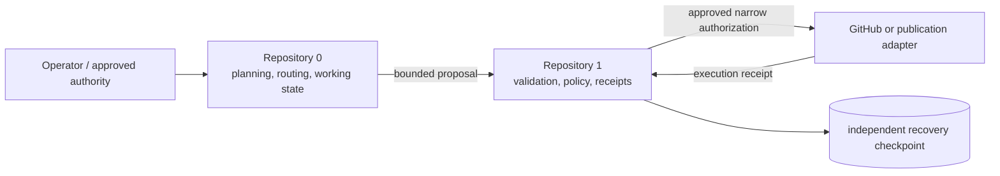

# 1 — Partitioned Versioning Trust Core

Repository **1** is the candidate conservative state and trust layer for the AEVESPERS system. It is intended to verify bounded transition proposals, evaluate explicit authority, record accepted and rejected decisions, and support checkpoint recovery without giving Muse, Repository `0`, CI, a GitHub token, or an external adapter authority to rewrite canonical history.

> **Status:** `P0 — REVIEW / APPROVAL REQUIRED`. Documentation, schemas, and a small reference policy evaluator exist. They do not establish a secure transport, complete verifier, durable append-only ledger, deployable service, or verified recovery system.

## Proposed responsibilities

- versioned VTX envelope verification;
- deny-by-default capability and partition policy;
- replay, expiry, nonce, and payload-digest checks;
- append-only accepted and rejected transition receipts;
- recovery checkpoints and isolated restoration simulation;
- narrowly scoped external publication authorization;
- reconciliation of execution receipts;
- explicit trust-anchor and capability metadata.

## Relationship to Repository 0

Repository `0` may propose changes. Repository `1` is intended to determine whether a proposed transition is admissible into canonical history. This boundary remains a candidate until the product charter and cross-repository route are approved.

## Architectural decision required

Two inbound route descriptions currently conflict:

- `0:working → 0:proposal → 1:quarantine`
- `0:working → 1:quarantine`

The Architect must select one canonical contract or explicitly define `0:proposal` as non-authoritative local staging. Implementation must not silently resolve this difference.

## Documentation

- [GitHub Pages landing page](docs/index.md)
- [Project guide](docs/PROJECT_GUIDE.md)
- [Architecture](docs/ARCHITECTURE.md)
- [Contract and state-machine design](docs/DESIGN_CONTRACTS.md)
- [Developer onboarding](docs/DEVELOPER_ONBOARDING.md)
- [Operations and recovery playbook](docs/OPERATIONS.md)
- [Muse access model](docs/MUSE_ACCESS_MODEL.md)
- [Task chain](taskchain.md)
- [Release plan](release.md)
- [Changelog](changelog.md)

## Candidate repository layout

- `docs/` — architecture, authority boundaries, design, onboarding, operations, and Pages content;
- `schemas/vtx-envelope.schema.json` — candidate transition-request contract;
- `schemas/transition-receipt.schema.json` — candidate accepted/rejected decision record;
- `schemas/state-path-event.schema.json` — candidate advisory path-event contract;
- `partitioned_versioning/` — reference policy and verification primitives;
- `taskchain.md` — sequencing, acceptance criteria, and stop conditions;
- `release.md` — blocked release posture and evidence gates;
- `changelog.md` — dated product, architecture, evidence, and release history.

## Local MVP boundary

The first possible executable milestone is a **local-only, credential-free reference prototype** with deterministic positive and negative fixtures. It may cover contract validation, deny-by-default policy, replay/expiry checks, local receipt chaining, checkpoint verification, recovery simulation, and an explicitly approved advisory path-audit function.

It excludes:

- network listeners and webhooks;
- GitHub write automation;
- production secrets or root keys;
- remote publication;
- autonomous approval or trust-anchor rotation;
- destructive history changes;
- claims that schemas or heuristic scores prove security.

## Safety principle

No GitHub token held by Muse, Repository `0`, CI, or an external service should be sufficient to mutate Repository `1` canonical state, policy, receipts, trust anchors, or recovery checkpoints. External credentials may eventually create proposals or execute already-approved operations, but they must not become root credentials.

## Release posture

No release or deployment is authorized. A first candidate requires approved product and route decisions, deterministic contract and policy tests, durable receipt and recovery behavior, threat-model closure, clean-checkout reproducibility, provenance, artifacts, checksums, rollback evidence, and explicit approval at one immutable commit.
