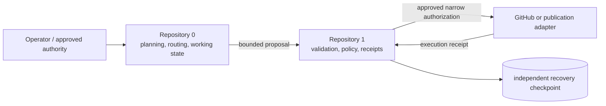

# 1 — Partitioned Versioning Trust Core

Repository **1** is the candidate conservative state and trust layer for the AEVESPERS and A.L.I.S.T.A.I.R.E. systems. It is intended to verify bounded transition proposals, evaluate explicit authority, record accepted and rejected decisions, and support checkpoint recovery without giving Muse, Repository `0`, CI, a GitHub token, or an external adapter authority to rewrite canonical history.

> **Status:** `P0 — REVIEW / APPROVAL REQUIRED`. Documentation, one observed state-path-event schema, and a small reference policy evaluator exist. They do not establish a secure transport, complete verifier, durable append-only ledger, deployable service, or verified recovery system.

## Proposed responsibilities

- versioned VTX envelope verification;
- deny-by-default capability and partition policy;
- replay, expiry, nonce, and payload-digest checks;
- append-only accepted and rejected transition receipts;
- recovery checkpoints and isolated restoration simulation;
- narrowly scoped external publication authorization;
- reconciliation of execution receipts;
- explicit trust-anchor and capability metadata.

## Relationship to Repository 0

Repository `0` may propose changes. Repository `1` is intended to determine whether a proposed transition is admissible into canonical history. This boundary remains a candidate until the product charter, capability-authority role, and cross-repository route are approved.

## Material gluing obstruction

Two inbound route descriptions currently conflict:

- `0:working → 0:proposal → 1:quarantine`
- `0:working → 1:quarantine`

The lowest-coupling repair candidate is to treat `0:proposal` as **non-authoritative local staging inside Repository `0`**, while the cross-repository contract begins when a versioned envelope is admitted into `1:quarantine`. This interpretation preserves Repository `0`'s proposal workflow without adding a Repository `1` partition or allowing local staging to become canonical authority. It remains a recommendation for explicit review, not an approved route.

No implementation may silently choose this interpretation. Approval requires shared positive, negative, stale, replay, unsupported-version, and rollback fixtures pinned to immutable commits in both repositories.

## Documentation

- [GitHub Pages landing page](docs/index.md)
- [Project guide](docs/PROJECT_GUIDE.md)
- [Architecture](docs/ARCHITECTURE.md)
- [Canonical-state and capability authority](docs/CAPABILITY_AUTHORITY.md)
- [Obstruction and gluing analysis](docs/OBSTRUCTION_AND_GLUING.md)
- [ADR-0001: candidate canonical-state and capability authority](docs/adr/0001-canonical-state-and-capability-authority.md)
- [Contract and state-machine design](docs/DESIGN_CONTRACTS.md)
- [Developer onboarding](docs/DEVELOPER_ONBOARDING.md)
- [Operations and recovery playbook](docs/OPERATIONS.md)
- [Muse access model](docs/MUSE_ACCESS_MODEL.md)
- [Task chain](taskchain.md)
- [Punch list](punchlist.md)
- [Release plan](release.md)
- [Changelog](changelog.md)

## Candidate repository layout

### Observed on the default branch

- `docs/` — architecture, access, audit, and candidate-boundary documentation;
- `schemas/state-path-event.schema.json` — observed advisory path-event contract;
- `partitioned_versioning/` — reference policy and verification primitives;
- `taskchain.md`, `punchlist.md`, `release.md`, and `changelog.md` — coordination and release controls.

### Planned contracts, not observed as accepted default-branch schemas

- versioned VTX envelope contract;
- accepted/rejected transition-receipt contract;
- capability, approval, revocation, checkpoint, and execution-receipt contracts;
- deterministic cross-repository fixture corpus.

Documentation must not describe planned schemas as validated implementation.

## Local MVP boundary

The first possible executable milestone is a **local-only, credential-free reference prototype** with deterministic positive and negative fixtures. It may cover contract validation, deny-by-default policy, replay/expiry checks, local receipt chaining, checkpoint verification, recovery simulation, and an explicitly approved advisory path-audit function.

It excludes:

- network listeners and webhooks;
- GitHub write automation;
- production secrets or root keys;
- remote publication;
- autonomous approval or trust-anchor rotation;
- destructive history changes;
- claims that schemas or heuristic scores prove security.

## Safety principle

No GitHub token held by Muse, Repository `0`, CI, or an external service should be sufficient to mutate Repository `1` canonical state, policy, receipts, trust anchors, or recovery checkpoints. External credentials may eventually create proposals or execute already-approved operations, but they must not become root credentials.

## Release posture

No release or deployment is authorized. A first candidate requires approved product, authority, and route decisions; deterministic contract and policy tests; durable atomic receipt-and-state behavior; a threat model; clean-checkout reproducibility; provenance; artifacts; checksums; rollback evidence; and explicit approval at one immutable commit.
