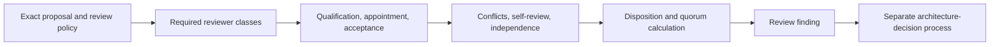

# Architecture Review Quorum Conformance

**Status:** independent synthetic consumer; documentation and validation only  
**Producer:** `aevespers2/qso-field.github.io` draft PR #24  
**Producer source:** `13f5f1a6cb4ba589c1a0e616ca40fc3f8dcfe028`  
**Consumer:** `aevespers2/1` draft PR #2  
**Authority effect:** none

Repository `1` independently evaluates the preserved twelve-case architecture-review quorum corpus and the separately versioned nine-case obstruction-coverage extension. It downloads both payloads from an immutable QSO Field source, calculates their canonical JSON identities, and derives all twenty-one outcomes through a Repository `1` implementation that imports neither the producer validator nor the QSO-STUDIO consumer.

This work closes a bounded conformance path. It does not qualify or appoint reviewers, establish a real quorum, decide architecture, activate implementation, bind permissions, or authorize merge, release, publication, deployment, recovery, or canonical-state mutation.

## Immutable producer identities

| Generation | Cases | Canonical JSON SHA-256 |
|---|---:|---|
| preserved base | 12 | `a8b65c3fce4b7cf80fdefab76c497720b2bf17086d431a53f9bacf82e58bd9ec` |
| obstruction-coverage extension | 9 | `6e767141e6c76ec43366b661db0fee9090a56c9ce7d50eda28da7f1094d5e3c2` |

The base remains byte-history preserving: its previously recorded canonical identity is not rewritten to add later obstruction cases. The extension carries the additional reason-code coverage as a distinct generation.

## Separation invariant

```text
matching synthetic payload identity
+ independent parsing and rule evaluation
+ matching twenty-one dispositions
+ retained exact-head evidence
= bounded cross-repository conformance

bounded conformance
!= policy acceptance
!= reviewer qualification
!= reviewer appointment or acceptance
!= real quorum
!= architecture decision
!= activation
!= operational authority
```

## Evaluated base path



**Diagram alternative:** The evaluator first verifies exact source and policy identity. It then checks reviewer-class coverage, qualification, appointment, acceptance, conflicts, recusals, self-review, counted dispositions, quorum, independence, dissent, appeal state, and supersession. A clean review stops at `REVIEW_COMPLETE_PENDING_DECISION`; a separate process must create any architecture decision.

The base consumer verifies that:

- stale or unqualified reviewers do not count;
- missing appointment or acceptance blocks completion;
- abstention and recusal are never approval;
- authority-bearing self-review is rejected;
- reviewer independence is counted by distinct independence groups;
- dissent remains durable;
- review completion cannot be promoted into a decision;
- pending appeals and superseded findings remain separately represented.

## Supplemental obstruction path

The extension independently checks:

- incomplete reviewer-class coverage;
- undisclosed common control;
- unresolved conflict or recusal;
- incompatible-role double counting;
- unauthorized or expired appeals;
- incomplete or conflicted appeal panels;
- emergency scope broadening; and
- stale findings after supersession.

Appeal-only failures derive `APPEAL_BLOCKED`; all other extension obstructions derive `REVIEW_INCOMPLETE`. A clean extension result is `COVERAGE_EXTENSION_CLEAR`, which is evidence coverage—not review completion or authority.

## Fail-closed input controls

The Repository `1` consumer rejects:

- duplicate JSON keys;
- invalid UTF-8;
- non-finite numbers;
- oversized fixture payloads;
- prohibited secret- or biometric-bearing field names;
- malformed reviewer and policy structures;
- duplicate reviewer or case identities;
- incorrect case counts;
- unknown extension fields or overrides;
- non-Boolean extension controls;
- missing reason or disposition coverage;
- canonical-payload digest drift; and
- any expected outcome that differs from the independently derived result.

## Reproduction

The exact-head workflow retrieves the producer files over HTTPS from the immutable producer commit, runs ten hostile regressions, evaluates both corpora, records consumer and producer source identities, writes a deterministic report, hashes the consumer source and evidence set, and retains the artifact.

Local test command:

```bash
python -m unittest tests.test_architecture_review_quorum_contract -v
```

Workflow validation command after the immutable fixtures are retrieved:

```bash
python scripts/validate_architecture_review_quorum.py \
  --base evidence/architecture-review-quorum/base.json \
  --extension evidence/architecture-review-quorum/extension.json \
  --report evidence/architecture-review-quorum/validation.json
```

## Portfolio role

Repository `1` is an appropriate second independent consumer because its candidate role is conservative validation, quarantine, lifecycle disposition, and recovery—not proposal authorship or architecture activation. That architectural fit does not appoint Repository `1` as a reviewer or decision authority. It only provides an independent implementation surface for the synthetic contract.

QSO-STUDIO remains the first independent read-only review-surface consumer. Repository `1` is a separately implemented conservative-authority candidate consumer. Together with QSO Field's producer implementation, the three implementations provide a bounded multi-consumer witness for this exact base-plus-extension generation.

## Rollback and supersession

Any change to the producer source, decoded corpus objects, canonicalization procedure, reason codes, expected states, consumer implementation, tests, or workflow creates a new conformance generation. Earlier evidence remains historical for its immutable tuple.

If the consumer diverges or an artifact becomes unavailable:

1. mark the affected conformance claim `PARTIAL_OR_UNKNOWN`;
2. withdraw downstream claims that the multi-consumer sub-gate is closed;
3. preserve the last valid producer and consumer evidence;
4. correct or supersede the defective generation; and
5. rerun every required independent consumer before restoring the claim.

No rollback may represent a historical fixture result as current policy acceptance, real reviewer service, architecture approval, or activation.

## Remaining architecture decisions

The following remain unresolved:

- neutral policy, fixture, canonicalization, namespace, reason-code, validator, and registry custody;
- reviewer classes, qualifications, appointments, acceptance, terms, deputies, vacancies, conflicts, recusals, abstentions, dissent, replacement, and privacy;
- quorum formulas, incompatible-role matrices, common-control and independence tests;
- appeal standing, panels, stays, deadlines, remedies, and emergency-review limits;
- trusted signatures and time;
- supersession propagation and rollback ownership;
- acceptance, revision, split, hold, or rejection of ADR-0020 and its proposed contract generation.

Until those decisions are recorded, the disposition remains:

`EVIDENCE_SATISFIED_AT_RECORDED_SYNTHETIC_TUPLE — NO AUTHORITY`
