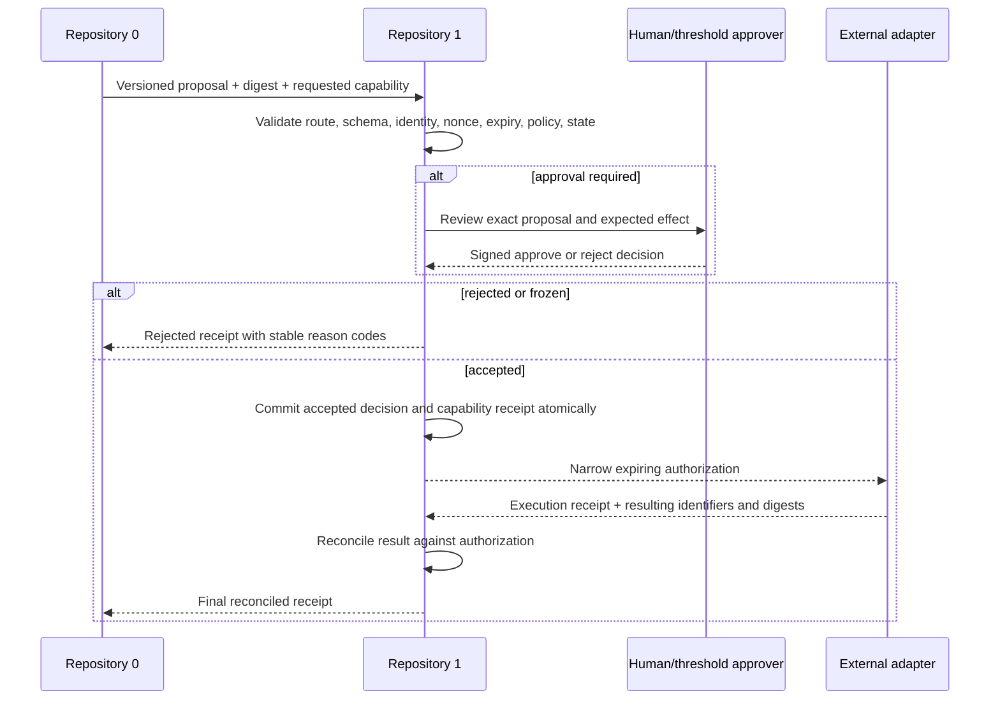

# Canonical-State and Capability Authority

## Status

**Candidate architecture — review required.**

Repository `1` is proposed as the independently reviewable authority that decides whether a bounded request may affect canonical A.L.I.S.T.A.I.R.E. state or receive a narrowly scoped capability. This document defines the intended boundary; it does not activate a service, issue a credential, approve a route, or establish production security.

## Portfolio role

The portfolio separates four responsibilities that must not collapse into one actor:

| Responsibility | Candidate owner | Boundary |
|---|---|---|
| Product mission, constitutional policy, repository roles | `ALISTAIRE-` | Defines accepted governance; does not execute requests or hold operational credentials |
| Autonomous planning, patch generation, test execution, proposal preparation | Repository `0` | May propose work; may not grant itself authority or write canonical state |
| Canonical-state decisions, capability issuance, revocation, receipts, recovery | Repository `1` | May evaluate accepted policy; may not silently change constitutional policy or approve its own root-policy changes |
| External execution | GitHub, publication, model, payment, infrastructure, or other adapters | May perform one approved operation; may not broaden the authorization or become canonical merely by succeeding |

A token accepted by an external platform proves only that the platform will accept an API call. A Repository `1` capability is intended to prove that the A.L.I.S.T.A.I.R.E. governance system authorized that exact bounded operation under an identified policy version.

## Constitutional inputs

Repository `1` must evaluate only immutable, explicitly accepted inputs:

1. the approved A.L.I.S.T.A.I.R.E. governance charter and decision record;
2. versioned Repository `0` → Repository `1` route and envelope contracts;
3. accepted identity, capability, partition, consent, data, security, and emergency policies;
4. the exact request, payload digest, target state, approvals, nonce, and expiry;
5. current canonical state, revocation state, freeze state, and replay history.

Prompts, issue text, retrieved content, model output, comments, transport messages, ceremonial titles, previous approvals, or successful CI cannot independently grant authority.

## Authority classes

| Class | Examples | Candidate decision rule |
|---|---|---|
| `C0 — observe` | read public metadata, inspect approved evidence | may be pre-authorized under bounded read policy; no secrets or private canonical state |
| `C1 — propose` | create isolated branch, prepare patch, open draft PR | narrow repository and branch scope, short expiry, no protected-state mutation |
| `C2 — reversible maintenance` | update approved documentation or low-risk generated artifacts | exact target, expected head, deterministic checks, rollback, and receipt required |
| `C3 — consequential` | private data access, persistent memory, external model/tool call, repository write, workflow action | explicit human or threshold approval, data classification, audit, revocation, and emergency stop required |
| `C4 — critical` | protected merge, release, deployment, payment, secret rotation, identity issuance, canonical migration, governance change | independent human approval and separation of requester, verifier, approver, executor, and recovery owner where practical |

The local MVP may model these classes and validate fixtures, but it must not issue live credentials or execute remote effects.

## Capability envelope

A capability contract should be versioned and contain, at minimum:

- immutable capability identifier;
- issuer identity and accepted issuer policy;
- subject identity;
- repository, environment, adapter, and resource scope;
- permitted operations and explicitly prohibited operations;
- source and destination partitions where relevant;
- target branch, object, state reference, and expected head;
- payload or proposal digest;
- issue time, not-before time, expiry, and maximum use count;
- nonce and replay domain;
- required approval identifiers and approval-policy version;
- data classification and retention constraints;
- resource, cost, size, duration, and rate limits;
- audit destination;
- revocation handle;
- emergency-stop domain;
- rollback or compensation reference.

Unknown fields, unknown versions, ambiguous scope, missing approvals, invalid time, replay, revoked identity, frozen domain, or unverifiable canonical state must fail closed.

## Issuance lifecycle

An execution result does not become canonical until Repository `1` verifies that it matches the issued authorization and records the reconciliation under the accepted state policy.

## Separation of duties

| Role | May | Must not |
|---|---|---|
| Requester | submit a bounded request | issue or approve its own elevated authority |
| Policy owner | define proposed policy changes | activate unreviewed policy or erase prior evidence |
| Verifier | reproduce contract, policy, and state checks | alter the submitted request or acceptance criteria |
| Approver | approve an exact immutable request | approve an unspecified future class of critical actions |
| Capability issuer | issue only after required evidence and approvals | broaden scope, skip expiry, or issue while frozen |
| Executor | perform the exact authorized operation | reuse authority for another target or operation |
| Reconciler | compare execution receipt with authorization | treat unmatched external state as canonical |
| Recovery owner | freeze, restore, and verify checkpoints | destroy incident evidence or self-unlock without approval |

One person may fill more than one role in an early research prototype, but the evidence must still record the roles separately. Automated components may not become the sole requester, verifier, approver, issuer, and recovery authority for a consequential action.

## Canonical-state properties

A state transition is admissible only when:

1. the inbound route and contract version are accepted;
2. request serialization and digest are deterministic;
3. the issuer and subject are recognized and not revoked;
4. the capability request is within accepted policy;
5. nonce, expiry, replay, expected-head, and approval checks pass;
6. the proposed state can be staged without mutating canonical state;
7. the accepted receipt and resulting state can be committed atomically;
8. the resulting receipt chain and checkpoint references remain verifiable.

Rejected requests should also produce durable, privacy-safe receipts so denial behavior, abuse patterns, and policy failures can be audited without exposing secrets.

## Revocation and emergency stop

Revocation and freeze controls must be independent of the component being stopped. A portfolio or domain freeze should prevent new capability issuance and consequential promotion while preserving read-only evidence access.

Triggers include:

- credential or key exposure;
- unrecognized issuer, subject, or policy version;
- unauthorized external effect;
- replay, receipt-chain break, digest mismatch, or expected-head mismatch;
- provenance loss or canonical-state ambiguity;
- uncontrolled self-modification or capability broadening;
- consent, privacy, or data-governance breach;
- failed recovery or missing audit evidence.

There is no automatic unlock. Recovery requires cause analysis, relevant credential rotation, exact-state reconstruction, deterministic verification, bounded restart order, rollback readiness, and explicit approval.

## Cross-repository contracts

| Edge | Required contract | Required witness |
|---|---|---|
| `ALISTAIRE-` → Repository `1` | governance-policy identifier, accepted decision, role map, emergency domains | immutable charter commit and approval record |
| Repository `0` → Repository `1` | route, envelope, proposal identity, requested authority, payload digest | shared positive and negative fixtures at pinned commits |
| Repository `1` → adapter | narrow capability, target, expected effect, expiry, use count | executor fixture proving out-of-scope calls fail |
| adapter → Repository `1` | execution receipt, platform object IDs, resulting digests, errors | reconciliation fixture for success, mismatch, timeout, duplicate, and partial failure |
| Repository `1` → runtime/QSO | accepted capability or state reference | runtime fixture proving absence or revocation fails closed |
| Repository `1` → Studio/AionUi | redacted state, receipts, reason codes, review requests | read-only fixture proving UI cannot mutate authority directly |
| Repository `1` ↔ Bridge | evidence transport and verification metadata | schema/version compatibility and replay fixtures |

## Deterministic fixture minimum

Before implementation promotion, fixtures should cover:

- unknown and unsupported versions;
- valid bounded `C0` and `C1` requests;
- self-approval attempts;
- missing, stale, malformed, conflicting, or overbroad approvals;
- nonce reuse and cross-domain replay;
- expiry boundary conditions and clock uncertainty;
- subject, issuer, repository, branch, operation, or environment mismatch;
- protected branch and Repository `1` self-mutation attempts;
- capability use after revocation or freeze;
- external execution mismatch, duplicate receipt, partial failure, and timeout;
- atomic-persistence failure between receipt and state;
- checkpoint corruption and rollback attack;
- restart while freeze remains active;
- redaction of secrets and private fields from evidence artifacts.

## Open architectural decisions

- approve, revise, or reject Repository `1` as the portfolio capability authority;
- select the canonical Repository `0` inbound route;
- assign schema and package ownership for capabilities, envelopes, receipts, approvals, and revocations;
- define the authoritative private/offline state and key-custody model;
- name human owners for policy, security, approval, credentials, incident response, emergency stop, and recovery;
- define canonical clock, replay-domain, retention, redaction, and correction rules;
- approve the boundary between Repository `1`, Bridge, and external adapters;
- decide whether any low-risk capability class may later be pre-authorized and under what measurable limits.

Until these decisions and deterministic evidence exist, Repository `1` remains a documentation and local-reference candidate with no production authority.
