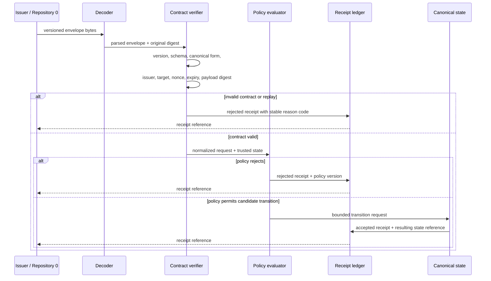

# Contract and State-Machine Design

## Status

This document records the current candidate design and the decisions still required before implementation work can become `READY`. It does not approve a route model, cryptographic suite, serialization profile, key hierarchy, or deployment surface.

## Design principles

1. **Deny by default.** Unknown issuers, operations, partitions, versions, and error states reject.
2. **Deterministic decisions.** The same accepted inputs, policy version, and trusted state produce the same result.
3. **Explicit authority.** Proposal, review, canonicalization, publication, recovery, and policy-change powers are separate capabilities.
4. **Receipt every decision.** Accepted and rejected requests produce structured evidence.
5. **Small transitions.** Each request names one bounded operation and one primary partition movement.
6. **No implicit promotion.** Git commits, pull requests, workflow success, or file presence never imply canonical acceptance.
7. **Reversible local prototype.** The first executable milestone contains no network listener, production credential, or remote mutation.

## Candidate route decision

Two incompatible descriptions currently exist:

The Architect must choose one of the following:

| Option | Meaning | Consequence |
|---|---|---|
| A — proposal partition is contractual | `0:proposal` is a versioned source state referenced by the envelope | both repositories need shared fixtures and explicit ownership |
| B — proposal is local staging | Repository `0` may use `proposal` internally, but Repository `1` receives only a versioned envelope from `0:working` | the cross-repository contract must not depend on the staging label |
| C — direct route only | `0:proposal` is removed from the documented route | Repository `0` documentation and tests must be revised |

No implementation or documentation should silently select an option.

## Envelope processing pipeline

## Validation order

The verifier should evaluate inputs in a stable order so failures are reproducible and do not expose unnecessary detail:

1. byte and size limits;
2. supported envelope version;
3. schema shape and required fields;
4. canonical serialization profile;
5. target repository and operation namespace;
6. issuer identity and capability reference;
7. signature or authentication evidence, when implemented;
8. issued-at, expiry, nonce, and replay state;
9. payload digest and referenced-state digest;
10. source and destination partition validity;
11. required approval evidence;
12. deny-by-default policy decision;
13. receipt construction and persistence.

A storage failure must not be converted into an accepted transition. If a receipt cannot be durably recorded, the transition fails closed.

## Stable error taxonomy

The first specification should define machine-readable reason codes. Candidate groups include:

- `contract.unsupported_version`
- `contract.invalid_shape`
- `contract.noncanonical_encoding`
- `authority.unknown_issuer`
- `authority.capability_missing`
- `authority.capability_expired`
- `request.expired`
- `request.replay_detected`
- `request.digest_mismatch`
- `route.unknown_partition`
- `route.transition_denied`
- `approval.missing`
- `policy.denied`
- `storage.receipt_failed`
- `recovery.checkpoint_invalid`

Exact names remain subject to P2 specification. Error text may change; reason-code semantics must be versioned.

## Capability model

Capabilities should be narrow, explicit, and revocable. A capability should bind at least:

- issuer identity;
- target repository;
- operation set;
- allowed source and destination partitions;
- branch or state namespace, if applicable;
- maximum lifetime;
- approval requirements;
- delegation prohibition or limits;
- revocation reference;
- policy version or compatibility range.

A GitHub token, CI identity, or transport credential is not itself a Repository `1` capability.

## Receipt properties

An accepted or rejected receipt should be sufficient to reproduce why a decision occurred without including secrets. Candidate fields include:

- receipt schema version;
- request digest;
- decision and stable reason codes;
- policy version and verifier version;
- trusted-state reference;
- previous receipt digest, if chained;
- resulting state digest or unchanged-state marker;
- timestamp source and sequence information;
- approval references;
- execution-authorization reference, when applicable;
- redacted diagnostic metadata.

Receipt chaining is a design target, not an implemented guarantee.

## Checkpoint and recovery design

A checkpoint should bind:

- canonical state digest;
- receipt-chain head;
- policy and contract versions;
- trusted capability and revocation state;
- creation authority;
- independent verification evidence;
- recovery compatibility metadata.

Recovery should run first as a simulation that reconstructs state in an isolated location, verifies all digests and policy references, compares the reconstructed state to the checkpoint, and produces a recovery report. Restoration into authoritative state requires a separately approved operation and receipt.

## Path-audit boundary

Path auditing may detect missing events, unexpected transitions, digest discontinuity, stale approvals, or unusual token assignments. These findings may prioritize review, but they do not override the canonical policy evaluator.

A path-audit design is not acceptable until it defines:

- event ownership and schema version;
- deterministic ordering;
- stable finding codes;
- threshold and weighting rationale;
- false-positive and false-negative fixtures;
- behavior for missing or contradictory data;
- interaction with policy decisions;
- explicit statement that findings are advisory.

## Required fixture matrix

| Area | Positive fixtures | Negative fixtures |
|---|---|---|
| Contract | supported canonical envelope | unknown version, extra fields, malformed encoding |
| Identity | known issuer with valid capability | unknown issuer, revoked or expired capability |
| Time/replay | fresh nonce and valid expiry | replayed nonce, expired request, invalid clock window |
| Digest | matching payload and state reference | payload tamper, wrong prior state |
| Route | approved source/destination edge | unknown partition, skipped stage, self-promotion |
| Approval | required approval references present | missing, stale, or self-issued approval |
| Ledger | receipt stored and chain advances | write failure, prior-head mismatch, corruption |
| Recovery | valid checkpoint reconstructs exactly | altered checkpoint, missing receipt, incompatible policy |
| Path audit | known finding produces stable advisory output | score changes authorization or nondeterministic ordering |

## Compatibility rules

- Contract and policy versions must be explicit.
- Unknown major versions reject.
- Additive fields are accepted only when the active schema explicitly permits them.
- Canonicalization changes require migration fixtures and digest-impact documentation.
- Repository `0` and Repository `1` must share route fixtures at immutable commits.
- A migration must preserve old receipts or provide a separately verifiable translation record.

## P2 decisions still required

- canonical Repository `0` route;
- schema and package ownership;
- serialization profile;
- identity and authentication model for the local prototype;
- nonce and replay-state persistence;
- receipt storage format and atomicity;
- checkpoint format and recovery ceremony;
- capability lifecycle and revocation;
- stable reason-code registry;
- path-audit inclusion or deferral;
- exact test and evidence outputs.
