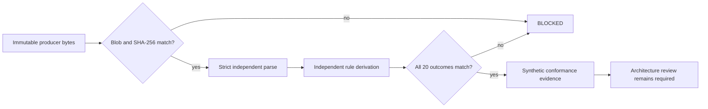

# Independent Evidence Retention, Renewal, Availability, and Tombstone Conformance

Status: `REVIEW — SYNTHETIC INDEPENDENT CONSUMER ONLY`

Repository `1` independently consumes QSO Field's evidence-retention fixture at an immutable producer commit. This work proves only that a separately implemented validator derives the same twenty synthetic outcomes from the same bytes. It does not operate an archive, renew evidence, extend retention, approve or withdraw a claim, place a legal hold, delete data, publish, merge, release, deploy, recover production state, or activate operational authority.

## Composition boundary

```text
workflow success
!= artifact digest
!= artifact availability
!= active retention
!= valid renewal
!= current claim support
!= completed deletion
!= rollback-safe restoration
```

The independent consumer fails closed when source identity, digest verification, availability, retention deadline, renewal generation, source equivalence, artifact reverification, verifier independence, claim rebinding or downgrade, copy reverification, deletion propagation, or rollback safety is missing.

## Immutable producer tuple

- repository: `aevespers2/qso-field.github.io`
- producer commit: `155437912906a0119a087d63bf4ed889368a4a9f`
- producer path: `fixtures/evidence-retention-renewal-v1.json`
- expected Git blob: `f624abed1f72fbb7e6f2dbe5b443cce891abc05c`
- expected SHA-256: `9d4c78fc8c9b54a91bd272a4bc929dc368d3af23b62cf2eec1d833b9a7ec449f`
- cases: `20`
- ordered obstruction reasons: `16`
- dispositions: `EVIDENCE_CURRENT`, `EVIDENCE_RENEWED_PENDING_CLAIM_REBINDING`, `EVIDENCE_HISTORICAL`, `EVIDENCE_TOMBSTONED`, and `BLOCKED`

The workflow retrieves the fixture from that exact commit and checks the Git blob and SHA-256 before semantic validation.

## Independent implementation

`scripts/validate_evidence_retention_renewal.py` does not import QSO Field's validator. It independently:

- decodes strict UTF-8 and rejects duplicate JSON keys and non-finite values;
- rejects unknown, missing, sensitive, or non-Boolean fields;
- verifies exact fact, reason, disposition, and case registries;
- derives every obstruction reason from a separate rule table;
- derives all five dispositions without consulting the expected result first;
- requires complete reason and disposition coverage; and
- emits a deterministic report with no authority-bearing output.

The hostile regression suite covers byte/parser hazards, schema drift, sensitive fields, registry-order drift, type drift, expected-result drift, missing cases, and unregistered reasons.

## State diagram



Text alternative: exact producer bytes are verified before parsing; a separate validator derives all outcomes; any mismatch blocks; agreement creates synthetic evidence only and does not approve the policy.

## Rollback

Rollback removes this documentation, validator, tests, workflow, and evidence references from the candidate branch. It must not alter QSO Field evidence, claim status, retention, legal hold, deletion, publication, or operational state. Historical workflow evidence remains bound to its exact consumer commit.

## Remaining blockers

- neutral retention-policy, evidence-manifest, reason-code, fixture, tombstone, and rollback custody;
- trusted time, storage classes, availability probes, legal-hold and deletion policy;
- complete controlled-consumer registration and claim-withdrawal ownership;
- explicit architecture, security, privacy, licensing, accessibility, merge, release, publication, deployment, and rollback decisions.

No archive, renewal, deletion, claim, publication, merge, release, deployment, recovery, or operational authority is activated by this document.
