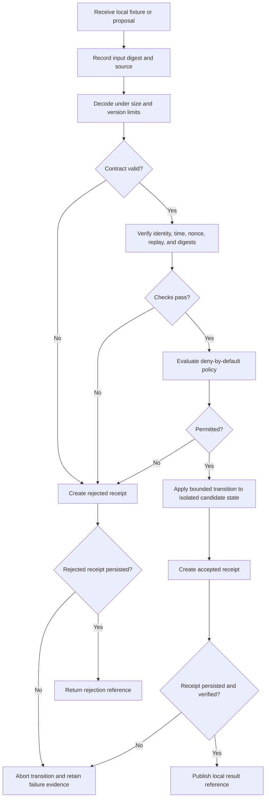
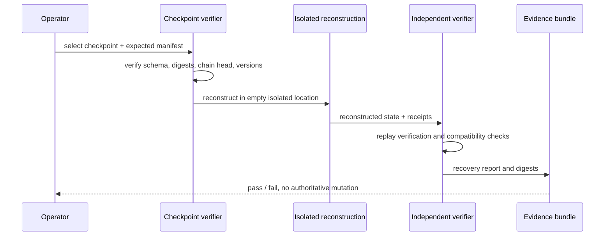

# Local Operations and Recovery Playbook

## Status and applicability

This playbook describes the evidence and operator procedures required for a future **local, no-network trust-core prototype**. It does not authorize deployment, token issuance, remote publication, production key custody, or restoration into authoritative state.

## Operating assumptions

- all inputs are local files or test fixtures;
- no production secrets are present;
- the candidate commit is immutable and recorded;
- policy, schema, and fixture versions are explicit;
- accepted and rejected decisions both produce receipts;
- failure to validate or record evidence rejects the transition;
- recovery first occurs in an isolated reconstruction directory.

## Preflight

Record the environment before running verification:

```bash
git status --short
git rev-parse HEAD
python --version
python -m pip --version
```

Confirm:

- working tree is clean;
- candidate commit matches the review record;
- expected schema and policy versions are present;
- fixtures are immutable or have recorded hashes;
- output directories are empty or uniquely named;
- no network credentials or production key material are loaded;
- rollback target is identified.

Stop if any preflight item is ambiguous.

## Candidate transition procedure



The procedure is a target operating model. Current repository artifacts do not yet prove that every step exists.

## Required evidence bundle

Each verification run should retain:

- repository and candidate commit;
- clean/dirty working-tree state;
- operating system, Python, and dependency versions;
- schema, policy, fixture, and capability-state versions;
- input file names and SHA-256 digests;
- exact commands and exit codes;
- accepted and rejected receipts;
- resulting state digests;
- test report and negative-case summary;
- warnings, limitations, and skipped checks;
- operator or reviewer identity reference;
- start and completion timestamps;
- rollback or cleanup result.

Do not retain secret material inside the evidence bundle.

## Receipt verification

For each receipt, verify:

1. schema version is supported;
2. request digest matches the recorded input;
3. decision and reason codes are recognized;
4. policy and verifier versions match the run record;
5. previous-receipt reference matches the expected chain head, when chaining is enabled;
6. resulting state reference is present for accepted transitions;
7. rejected transitions did not modify candidate state;
8. receipt bytes reproduce the recorded receipt digest;
9. persistence survived process restart in tests;
10. corruption produces a deterministic failure.

## Checkpoint creation

A future checkpoint operation should:

1. freeze the candidate canonical state for the operation;
2. verify the current receipt-chain head;
3. record policy, schema, capability, and revocation-state versions;
4. calculate content and metadata digests;
5. write the checkpoint to an isolated destination;
6. independently re-read and verify it;
7. create a checkpoint receipt;
8. retain a manifest and verification report.

Checkpoint creation must not rotate trust anchors or delete older checkpoints.

## Recovery simulation



A simulation passes only when reconstruction is exact, all required receipts are available, policy and contract versions are compatible, and an independent verification reproduces the expected digests.

## Restoration approval boundary

Restoration into authoritative state is separate from recovery simulation. It requires:

- explicit restoration authority;
- a named checkpoint and immutable manifest;
- impact and data-loss analysis;
- confirmation that the current state is preserved;
- a restoration transition contract;
- a new receipt referencing both prior and restored state;
- post-restoration verification;
- rollback plan if restoration validation fails.

No current documentation authorizes this operation.

## Incident handling

Treat the following as integrity incidents:

- receipt-chain discontinuity;
- checkpoint digest mismatch;
- replay accepted as fresh;
- unknown policy or schema version accepted;
- state modified after a rejected decision;
- path-audit score changing canonical authorization;
- unrecorded capability or trust-anchor change;
- evidence bundle not reproducible from the candidate commit;
- credential or secret material discovered in repository state.

### Immediate response

1. stop transitions;
2. preserve the exact working state and logs;
3. record the last independently verified checkpoint and receipt head;
4. do not rewrite or delete suspect evidence;
5. isolate credentials if any were exposed, without placing replacement secrets in the repository;
6. reproduce the failure from a clean checkout where safe;
7. open an incident record with impact, scope, evidence, and containment status;
8. require architectural and security review before resuming.

## Rollback

For documentation-only or local prototype changes, the preferred rollback is a Git revert to the last reviewed commit, followed by clean-checkout verification. For state-format changes, rollback must preserve receipts and provide a verifiable migration or restoration record; destructive history rewriting is prohibited.

Withdraw a candidate when:

- route semantics diverge across repositories;
- policy fails open;
- serialization or reason codes are nondeterministic;
- receipts cannot be persisted atomically;
- corruption or replay is accepted;
- checkpoint reconstruction differs;
- clean-checkout results are not reproducible;
- authority or key custody is ambiguous;
- claims exceed retained evidence.

## Remote integration gate

A local prototype passing does not authorize remote integration. Webhooks, GitHub write operations, publication adapters, network listeners, token assignment, and production key custody require a separate architecture decision, threat model, capability design, revocation procedure, abuse fixtures, deployment plan, monitoring, incident response, and rollback drill.
