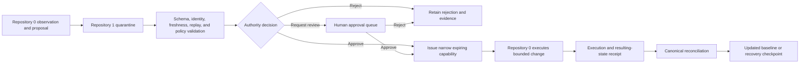

# Portable Device Trust Baseline Authority

## Mission

Repository `1` is the candidate independent trust core paired with Repository `0` for first installation on any laptop, phone, workstation, server, or constrained environment placed under the user's control. Its purpose is to preserve the approved security baseline, decide which proposed changes are authorized, retain canonical evidence, and support recovery when a device is lost, stolen, replaced, reset, or suspected of compromise.

Repository `1` does not perform broad host discovery or autonomous remediation. Repository `0` observes and proposes; Repository `1` evaluates authority, records decisions, issues narrowly scoped capabilities, and preserves the trusted state against which devices are compared.

## Canonical records

Repository `1` should eventually maintain versioned, integrity-protected records for:

- device identity and ownership scope;
- supported operating system and hardware class;
- approved baseline policy version;
- trusted bootstrap assumptions and clean-install source;
- package-manager and repository allowlists;
- expected startup agents, services, jobs, profiles, certificates, and extensions;
- network, DNS, proxy, VPN, route, firewall, hotspot, tethering, sharing, and Bluetooth policy;
- approved administrative identities and recovery owners;
- accepted Repository `0` proposals and exact resulting-state receipts;
- revocations, emergency freezes, quarantine state, recovery checkpoints, and replacement-device migrations;
- evidence hashes, timestamps, tool versions, limitations, and unresolved observations.

## Authority sequence

## Capability scope

A host-security capability must identify:

- the exact device or environment;
- requested operation and affected resources;
- expected pre-state and post-state;
- platform and policy versions;
- permitted commands or adapter methods;
- maximum duration, retries, cost, and change count;
- whether network access is allowed and to which destinations;
- rollback and evidence requirements;
- human approval requirements;
- issuer, requester, executor, verifier, revoker, and incident owner.

A capability cannot authorize a different device, broader network, additional package source, unrelated account, or later operation merely because the first operation succeeded.

## Lost, stolen, or replaced device workflow

1. Mark the prior device identity as lost, stolen, retired, or uncertain.
2. Revoke device-bound capabilities, sessions, certificates, and trusted peer relationships where supported.
3. Preserve the last known canonical baseline and recovery evidence.
4. Establish a new device identity from a trusted bootstrap path.
5. Install Repositories `0` and `1` before higher-level ecosystem components.
6. Inventory the new environment and compare it with the approved baseline.
7. Reissue only the minimum required credentials and capabilities.
8. Verify package managers, startup state, network controls, Bluetooth, hotspot, sharing, routes, proxies, DNS, and local trust stores.
9. Record the new recovery checkpoint and keep the previous identity revoked.

Repository `1` must not claim that remote revocation succeeded on an unavailable device unless the external authority provides verifiable evidence.

## Gluing contract with Repository `0`

The canonical cross-repository edge is:

`0:working/local proposal → versioned proposal envelope → 1:quarantine`

Any `0:proposal` partition remains non-authoritative local staging inside Repository `0`. Repository `1` begins its responsibility at quarantine admission. Shared fixtures must prove:

- accepted supported-version proposal;
- malformed or unsupported proposal rejection;
- stale and replayed request rejection;
- expected-head mismatch rejection;
- device-identity mismatch rejection;
- partial-execution and rollback handling;
- capability expiry and revocation;
- receipt reconciliation without treating execution success as automatic canonical acceptance.

## Security invariants

- Repository `1` is not the sole holder of all recovery authority.
- Private keys and sensitive baselines are not published through GitHub Pages.
- Canonical state is not derived from unauthenticated host reports alone.
- A compromised Repository `0` cannot mint its own capability or approve its own baseline.
- A successful command does not prove the device is fully secure.
- Unknown platform state remains `UNKNOWN`, not implicitly compliant.
- Emergency stop and revocation remain available independently of the device being assessed.
- Recovery evidence must survive loss of the original device.

## Non-goals

Repository `1` does not authorize:

- control of devices without ownership or explicit permission;
- intrusive surveillance, traffic interception, exploitation, or retaliation;
- unreviewed deletion of forensic evidence;
- universal claims of compromise detection;
- storing live secrets in repository documentation or public artifacts;
- silent activation of remote administration;
- bypassing mobile-platform restrictions or device-management policy.

## Required next documentation

- portable baseline schema and versioning policy;
- device identity and replacement lifecycle;
- key custody, recovery quorum, and offline backup topology;
- per-platform control matrix;
- capability and receipt schemas shared with Repository `0`;
- emergency loss, theft, compromise, quarantine, and clean-reinstall playbooks;
- privacy and data-retention policy for device inventories;
- deterministic gluing fixtures for the complete bootstrap and recovery path.
