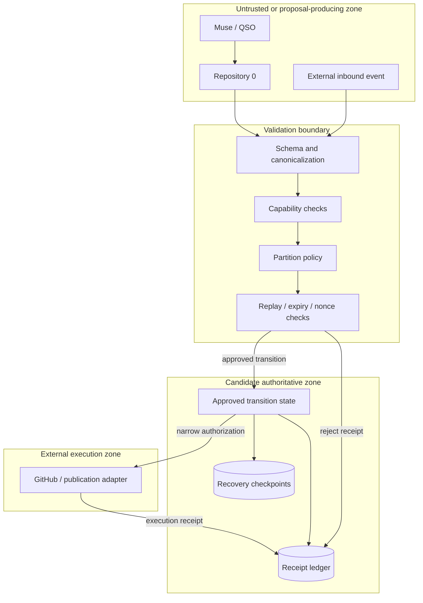

# Project Guide

## Purpose

Repository `1` is the candidate **Partitioned Versioning Trust Core** for AEVESPERS. It is intended to separate proposal generation from canonical-state authority so that planning systems, assistants, CI, GitHub integrations, and publication adapters can request bounded transitions without inheriting root authority.

The current repository is an early local prototype candidate. The product boundary is not yet approved, and the committed artifacts do not establish a secure transport, durable ledger, complete verifier, or deployable service.

## Intended user outcome

An authorized operator should eventually be able to:

1. receive a bounded transition proposal from Repository `0`;
2. verify the proposal against a versioned contract;
3. evaluate explicit capabilities and partition rules;
4. accept or reject the transition deterministically;
5. retain an append-only receipt for the decision;
6. create and verify a checkpoint; and
7. simulate restoration without giving the proposal source authority over canonical history.

## Scope by evidence class

### Observed on the default branch

- project and architecture documentation;
- candidate JSON Schemas for VTX envelopes, transition receipts, and state-path events;
- a small deny-by-default Python policy evaluator;
- access and audit design material.

These artifacts are candidate inputs to review. Their existence is not proof of contract correctness, cryptographic verification, replay protection, durable storage, checkpoint recovery, or integration safety.

### Candidate work outside the default branch

Draft PR #1 contains additional path-audit and token-assignment preflight concepts. That work remains early candidate evidence, has no exact-head workflow evidence recorded in the release plan, and must not become canonical authorization logic without separate approval and deterministic fixtures.

### Not implemented or not verified

- approved product charter and authority model;
- reconciled Repository `0` → Repository `1` route;
- canonical serialization and error taxonomy;
- signature, replay, expiry, and nonce verification;
- durable append-only receipt storage;
- receipt-chain corruption detection;
- checkpoint creation and restoration;
- private or offline root-authority design;
- key and capability lifecycle;
- remote adapters or publication workflows;
- release artifacts, provenance, checksums, or rollback drill.

## Non-goals

The local MVP must not:

- replace Git or GitHub;
- operate a network listener;
- contain production secrets or root keys;
- authorize remote mutation;
- rotate trust anchors autonomously;
- treat heuristic path scores as proof of compromise;
- permit an issuer to approve its own privileged transition;
- imply that schemas alone create secure transport;
- widen into portfolio orchestration or autonomous planning.

## Repository relationships

| System | Proposed responsibility | Authority boundary |
|---|---|---|
| Repository `0` | planning, routing, working state, proposal construction | may propose; may not write Repository `1` canonical state |
| Repository `1` | contract validation, partition policy, receipts, checkpoints, recovery | candidate canonical authority; must fail closed |
| Muse / QSO | produce bounded work products through Repository `0` | proposal-only authority unless separately granted |
| CI | reproduce tests and evidence | cannot approve policy or mutate canonical history |
| GitHub adapter | execute one approved remote operation | receives narrow, expiring authority only |
| Public repository | source mirror and review surface | must not be treated as the sole root of trust |

## Trust zones

A compromise in the proposal or execution zones must not grant authority to rewrite policy, receipts, trust anchors, or recovery checkpoints.

## Proposed core contracts

### VTX envelope

A versioned request that identifies the issuer, target repository, operation, source and destination partitions, payload digest, nonce, expiry, and required approvals.

### Transition receipt

An immutable decision record containing the request digest, decision, reason codes, policy version, resulting state reference, and links to prior receipts where receipt chaining is used.

### State-path event

An event used to describe or audit a path through partitions. Until separately approved, path findings are advisory observations and cannot override canonical policy.

## Product lifecycle

| Stage | Required outcome |
|---|---|
| P0 — charter | purpose, users, authority, route, partitions, non-goals, threat boundary, and release identity approved |
| P1 — inventory | every candidate artifact and claim bound to immutable commits |
| P2 — specification | named APIs, schemas, failure modes, fixtures, evidence outputs, and rollback defined |
| P3 — local MVP | no-network implementation passes deterministic positive and negative tests |
| P4 — optional adapter | proposal-only or publication-only authority, revocation, and receipts approved separately |
| P5 — release review | CI, security, provenance, artifacts, checksums, documentation, rollback, and approval pass |

## Documentation authority

When documents conflict, use this order for current work:

1. explicit Architect approval;
2. `taskchain.md` for sequencing and acceptance boundaries;
3. `release.md` for release claims and blockers;
4. approved architecture and contract decisions;
5. `changelog.md` for dated history;
6. implementation and tests as evidence of behavior, not automatic product authority.

## Stop conditions

Stop implementation and return to architectural review when:

- the canonical route is ambiguous;
- the issuer or approving authority is unclear;
- key or capability custody is undefined;
- serialization is not deterministic;
- a negative case fails open;
- a path score is being used as authorization;
- recovery cannot be reproduced;
- a remote credential is required for the local MVP;
- documentation claims exceed exact-head evidence.
