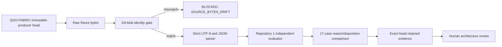

# Independent QSO Interface Compatibility Consumer

Repository `1` independently evaluates the bounded `QSO-INTERFACE-COMPATIBILITY-001` corpus published by QSO-FABRIC PR #21. The consumer is intentionally separate from the producer validator and from the QuantumStateObjects consumer implementation.

This layer proves only that Repository `1` can reproduce the recorded synthetic reason and disposition outcomes at an immutable producer tuple. It does not accept the interface architecture, assign namespace ownership, approve payload schemas, grant capabilities, or authorize execution, merge, release, publication, deployment, or canonical-state mutation.

## Immutable producer tuple

| Field | Bound value |
|---|---|
| Producer | `aevespers2/QSO-FABRIC` PR #21 |
| Producer head | `25036a5cfcea79e204a4660ddd1af09c054935b1` |
| Fixture path | `fixtures/qso-interface-compatibility-v1.json` |
| Fixture Git blob | `143b80448cb4623682669ab8e6a9599239dd5847` |
| Producer workflow | `29986841042` |
| Producer artifact | `8555344357` |
| Artifact digest | `sha256:09be1df24f4ab8b08708dd521c6720f4c95195d3e4379cecaad6d1a4b026a238` |
| Evidence expiry | `2026-10-21T06:59:56Z` |

The workflow retrieves the fixture from the immutable producer commit, verifies its Git blob before semantic parsing, and runs a separately authored validator. Any byte drift blocks before the fixture parser is invoked.

## Evidence flow



Prose equivalent: Repository `1` retrieves the immutable producer fixture, verifies raw-byte identity, parses it under strict JSON rules, independently derives ordered obstruction reasons and dispositions for all seventeen cases, retains exact-head evidence, and stops at human architecture review. Failure at any earlier stage blocks later processing.

## Independent validation boundary

The consumer rejects:

- invalid UTF-8, duplicate JSON keys, non-finite numbers, and oversized input;
- unknown or missing fields at the tuple, producer, consumer, fixture, case, facts, and expected-result levels;
- Boolean-as-integer ambiguity;
- producer head, path, workflow, artifact, digest, expiration, or Git-blob drift;
- fact-order, reason-order, case-order, case-coverage, or duplicate-case drift;
- unknown interface declarations presented as known;
- expected dispositions or reason lists that differ from independently derived outcomes;
- source-byte substitution before semantic parsing; and
- any authority effect other than `none`.

The two bounded positive cases derive `COMPATIBLE_PENDING_ARCHITECTURE_APPROVAL`. The remaining fifteen cases derive `BLOCKED` with ordered reasons. A positive synthetic result is not interface acceptance.

## Portfolio composition meaning

The existing QuantumStateObjects consumer and this Repository `1` consumer provide two separately implemented observations of the same declaration-level corpus. This closes the missing-second-consumer evidence gap only after both consumers are verified at current exact heads.

It does **not** close the deeper composition boundary:

```text
producer fixture
+ two independent declaration-level consumers
!= namespace ownership
!= canonical payload schemas
!= live producer/consumer compatibility
!= correction propagation
!= rollback closure
!= ecosystem admission
!= execution authority
```

Required triple-overlap witnesses still include:

1. runtime event or report → QSO-FABRIC aggregation → Repository `1` disposition;
2. correction or revocation → Bridge or presentation invalidation → recovery;
3. mixed-version migration → consumer rebinding → verified rollback.

## Material semantic obstruction

The names `qso-event-ledger` and `qso-runtime-report` currently cover both runtime-local QuantumStateObjects records and QSO-FABRIC collaboration or aggregate records. Architecture review must either:

- assign distinct qualified namespaces;
- define a shared envelope with mandatory producer and semantic-class partitioning; or
- reject the shared-name design.

Final contracts must define canonical bytes, record and run identities, ordering, causality, idempotency, replay and conflict handling, retry limits, correction, revocation, supersession, retention, privacy, signatures, trusted time, checkpoint/freeze behavior, rollback, recovery, and restored-state verification.

## FYSA-120 capability map

This bounded work applies:

- `CAT-012` — technical documentation and developer-facing conformance guidance;
- `CAT-017` — immutable source identity and supersession-grade provenance;
- `CAT-031` — verified software engineering and independent regression testing;
- `CAT-032` — distributed interface composition and overlap analysis;
- `CAT-040` — correction, migration, consumer rebinding, and rollback readiness;
- `CAT-044` — adversarial parser and contract evaluation;
- `CAT-052` — cryptographic source identity;
- `CAT-054` — cross-repository supply-chain integrity; and
- `CAT-059` — exact-head attestation and retained evidence transport.

Proposed non-authoritative subdivision: **cross-repository interface differential conformance**, including raw-byte identity, independently implemented semantics, ordered reason/disposition convergence, stale-consumer rebinding, correction propagation, and rollback witnesses.

## Review and release gates

Before this consumer can be treated as current portfolio evidence:

- all workflow jobs must complete successfully at the exact submitted head;
- retained artifact identity and digest must be recorded;
- the source tuple must remain current and available;
- the PR body and portfolio registry must be updated to the resulting exact head; and
- resulting-default-branch verification must occur after any later merge.

No release or deployment is authorized by this document or its workflow.
