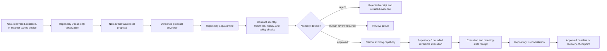

# Repository 1 — Portable Partitioned Versioning Trust Core

Repository `1` is a **candidate conservative trust, device-baseline, and canonical-state layer** for the AEVESPERS and A.L.I.S.T.A.I.R.E. systems. Paired with Repository `0`, it is intended to be installed early on a newly acquired, replaced, recovered, reset, or suspect owned device so that baseline decisions, capabilities, revocations, receipts, and recovery evidence remain independent from the component performing inspection or remediation.

Its proposed role is to evaluate bounded transition requests, preserve append-only decision evidence, issue or deny narrowly scoped capabilities, maintain approved baseline checkpoints, and support lost/replaced-device recovery without granting an agent, CI workflow, GitHub token, external adapter, or device command authority to rewrite canonical history.

> **Current status:** `P0 — REVIEW / APPROVAL REQUIRED`. The repository contains candidate documentation, one observed state-path-event schema, and a small policy evaluator. It is not a released security boundary, deployed service, durable ledger, device-management agent, credential issuer, or verified recovery system.

## Documentation map

- [Project guide](PROJECT_GUIDE.md)
- [Architecture](ARCHITECTURE.md)
- [Portable device trust baseline](PORTABLE_TRUST_BASELINE.md)
- [Portable Security Contract v0](PORTABLE_SECURITY_CONTRACT_V0.md)
- [Canonical-state and capability authority](CAPABILITY_AUTHORITY.md)
- [Obstruction and gluing analysis](OBSTRUCTION_AND_GLUING.md)
- [Independent evidence-retention conformance](EVIDENCE_RETENTION_RENEWAL_CONFORMANCE.md)
- [Independent QSO ecosystem conformance](QSO_ECOSYSTEM_CONFORMANCE.md)
- [Independent QSO interface compatibility conformance](QSO_INTERFACE_CONFORMANCE.md)
- [ADR-0001: candidate canonical-state and capability authority](adr/0001-canonical-state-and-capability-authority.md)
- [Contract and state-machine design](DESIGN_CONTRACTS.md)
- [Developer onboarding](DEVELOPER_ONBOARDING.md)
- [Operations and recovery playbook](OPERATIONS.md)
- [Muse access model](MUSE_ACCESS_MODEL.md)
- [Task chain on GitHub](https://github.com/aevespers2/1/blob/main/taskchain.md)
- [Punch list on GitHub](https://github.com/aevespers2/1/blob/main/punchlist.md)
- [Release plan on GitHub](https://github.com/aevespers2/1/blob/main/release.md)
- [Changelog on GitHub](https://github.com/aevespers2/1/blob/main/changelog.md)

The GitHub links intentionally point to repository source because a Pages site built from `docs/` does not publish files from the repository root.

## Portable first-install boundary

Repository `1` begins its cross-repository responsibility when a versioned proposal enters quarantine. `0:proposal` is documented by the shared contract as non-authoritative local staging inside Repository `0`; formal acceptance still requires shared fixtures and explicit approval.

A successful external command does not become canonical by success alone. Unsupported or unobservable platform state remains `UNKNOWN`. An unavailable prior device is not treated as remotely revoked unless the relevant external authority produces verifiable evidence.

## Shared contract candidate

[Portable Security Contract v0](PORTABLE_SECURITY_CONTRACT_V0.md) now provides a concrete pre-acceptance contract aligned with Repository `0`. It defines:

- the local-staging-to-quarantine route;
- device, environment, ownership, platform-profile, baseline, policy, producer, time, nonce, expected-head, digest, and evidence identifiers;
- `PASS`, `FAIL`, `UNKNOWN`, and `NOT_APPLICABLE` semantics;
- proposal-admission, narrow-capability, execution-receipt, reconciliation, revocation, emergency-stop, correction, and supersession rules;
- privacy, retention, canonicalization, integrity, versioning, and 18 shared fixture classes.

This documentation alignment is not yet an accepted machine-readable contract. Ownership, device identity derivation, key custody, canonical serialization, signatures, platform baseline authority, retention periods, recovery quorum, and named human approvals remain open.

## Candidate system boundary

The route conflict is now narrowed to one proposed interpretation:

| Candidate | Proposed path | Status |
|---|---|---|
| Local staging interpretation | `0:working → 0:proposal (local only) → versioned envelope → 1:quarantine` | documented in both repositories; approval and shared fixtures still required |

The local-staging interpretation preserves Repository `0`'s planning workflow while avoiding a duplicate Repository `1` proposal partition and preventing local staging from gaining authority.

After the route is approved, the intended processing boundary is:

| Stage | Candidate responsibility | Failure behavior |
|---|---|---|
| Inbound quarantine | retain the bounded device proposal without granting authority | reject malformed, unsupported, stale, replayed, or wrong-device input |
| Contract validation | validate version, shape, canonical form, device, baseline, issuer, target, nonce, expiry, and digests | issue a rejected receipt |
| Deny-by-default policy | evaluate explicit capability, partition, approval, platform, and device rules | issue a rejected receipt |
| Staged transition | compute the proposed resulting state without mutating canonical state | discard on any later failure |
| Atomic persistence | durably commit the accepted receipt and resulting canonical state together | fail closed if either write cannot complete |
| Optional execution | issue one narrow, expiring authorization to a platform adapter | retain the execution receipt or record failure |
| Recovery | verify an independent checkpoint and simulate restoration before approval | never overwrite canonical state implicitly |

This is a design target, not evidence that every component exists. Durable receipt storage, cryptographic verification, device identity, replay protection, checkpoint recovery, external adapters, authoritative key custody, per-platform profiles, and live capability issuance remain unimplemented or unverified.

## Portfolio authority separation

| Responsibility | Candidate owner | Must not collapse into |
|---|---|---|
| mission and constitutional governance | `ALISTAIRE-` | runtime execution or credential custody |
| portable bootstrap, inspection, planning, and proposal preparation | Repository `0` | self-approval or canonical writes |
| canonical device baseline, state decision, capability issuance, revocation, and recovery | Repository `1` | silent governance changes or self-approved root authority |
| platform execution | operating-system or explicitly approved adapter | canonical promotion merely because an operation succeeds |
| human review | QSO-STUDIO or AionUi | unsigned approval or capability minting |

## Proposed responsibilities

Repository `1` may eventually provide:

- device, baseline-policy, and platform-profile identity;
- versioned inventory, proposal, envelope, and receipt validation;
- explicit partition-transition and device-scope policy;
- wrong-device, replay, expiry, digest, and approval checks;
- accepted and rejected transition receipts;
- independently verifiable checkpoints and lost/replaced-device recovery simulation;
- narrowly scoped outbound authorization;
- reconciliation of external execution and resulting-state receipts.

It must not become:

- a general-purpose autonomous agent;
- a replacement for Git;
- a network-facing service in the local MVP;
- a device-management agent in the documentation candidate;
- a holder of production credentials in public repository state;
- an authority that approves its own policy changes;
- a source of security or compromise claims unsupported by exact-head evidence.

## Lifecycle model

| State | Entry condition | Allowed next states |
|---|---|---|
| Quarantine | a bounded inbound device proposal is retained | Rejected, Reviewed |
| Rejected | contract, identity, authority, time, replay, digest, route, approval, policy, platform, or storage checks fail | terminal receipt |
| Reviewed | deterministic checks pass but promotion is not yet durable | Rejected, Canonical |
| Canonical | accepted receipt and resulting baseline/state are committed atomically | Release, Recovery, Superseded |
| Release | separately approved publication completes | terminal execution receipt |
| Recovery | a checkpoint is verified and restoration is simulated | Canonical only through a separately approved receipt-producing operation |
| Superseded | device, baseline, or checkpoint is replaced while preserving history | terminal link to successor identity |

All movement is explicit and receipt-producing. A file does not become canonical merely because it exists in GitHub, appears in a pull request, passes CI, or reflects a successful device command.

## Current release posture

No release or deployment is authorized. Before a first local portable candidate can be considered, the repository needs an approved charter, accepted Portable Security Contract version, device and baseline identity model, capability-authority boundary, per-platform support matrix, privacy/retention policy, deterministic shared contract and policy tests, durable atomic receipt-and-state behavior, a threat model, clean-checkout reproducibility, provenance, artifacts, checksums, rollback evidence, loss/replacement recovery evidence, and explicit approval.

## Architectural clarification required

Formal approval is required for:

1. Repository `1` as canonical device-baseline, state, capability, revocation, receipt, checkpoint, and recovery authority;
2. Portable Security Contract v0 and the local-staging Repository `0` inbound route;
3. device identity, baseline-policy identity, ownership scope, replacement/retirement, and per-platform support semantics;
4. contract/package ownership for inventories, proposals, capabilities, approvals, receipts, revocations, corrections, resulting-state records, and checkpoints;
5. canonical serialization, signature, and private/offline authority-store and key-custody model;
6. privacy, redaction, retention, export, and deletion policy;
7. named human owners for policy, credentials, privacy, security, incident response, emergency stop, and recovery.

Until then, documentation may recommend and compare candidates, but implementation must not silently activate authority.
