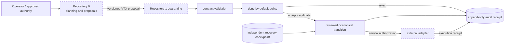
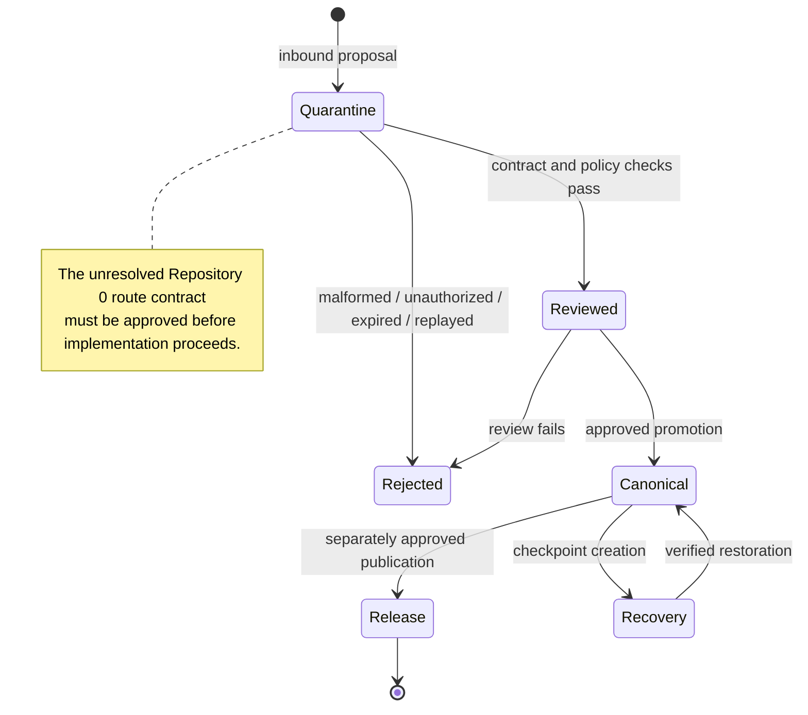

# Repository 1 — Partitioned Versioning Trust Core

Repository `1` is a **candidate conservative trust and state layer** for the AEVESPERS system. Its proposed role is to evaluate bounded transition requests, preserve append-only decision evidence, and support recovery without granting an agent, CI workflow, GitHub token, or external adapter authority to rewrite canonical history.

> **Current status:** `P0 — REVIEW / APPROVAL REQUIRED`. The repository contains candidate documentation, schemas, and a small policy evaluator. It is not a released security boundary, deployed service, durable ledger, or verified recovery system.

## Documentation map

- [Project guide](PROJECT_GUIDE.md)
- [Architecture](ARCHITECTURE.md)
- [Contract and state-machine design](DESIGN_CONTRACTS.md)
- [Developer onboarding](DEVELOPER_ONBOARDING.md)
- [Operations and recovery playbook](OPERATIONS.md)
- [Muse access model](MUSE_ACCESS_MODEL.md)
- [Task chain](../taskchain.md)
- [Release plan](../release.md)
- [Changelog](../changelog.md)

## Candidate system boundary

The diagram is a design target, not evidence that every component exists. In particular, durable receipt storage, cryptographic verification, replay protection, checkpoint recovery, external adapters, and authoritative key custody remain unimplemented or unverified.

## Proposed responsibilities

Repository `1` may eventually provide:

- versioned envelope and receipt validation;
- explicit partition-transition policy;
- replay, expiry, digest, and approval checks;
- accepted and rejected transition receipts;
- independently verifiable checkpoints and recovery simulation;
- narrowly scoped outbound authorization;
- reconciliation of external execution receipts.

It must not become:

- a general-purpose autonomous agent;
- a replacement for Git;
- a network-facing service in the local MVP;
- a holder of production credentials in public repository state;
- an authority that approves its own policy changes;
- a source of security claims unsupported by exact-head evidence.

## Lifecycle model

All movement is explicit and receipt-producing. A file does not become canonical merely because it exists in GitHub, appears in a pull request, or passes CI.

## Current release posture

No release or deployment is authorized. Before a first local candidate can be considered, the repository needs an approved charter and route model, deterministic contract and policy tests, durable receipt and checkpoint behavior, a threat model, clean-checkout reproducibility, provenance, artifacts, checksums, rollback evidence, and explicit approval.

## Architectural decision required

Repository `0` and Repository `1` currently describe different inbound routes:

1. `0:working → 0:proposal → 1:quarantine`
2. `0:working → 1:quarantine`

The Architect must select one canonical contract or define `0:proposal` as non-authoritative local staging. Until then, documentation may explain both candidates, but implementation must not silently choose between them.
